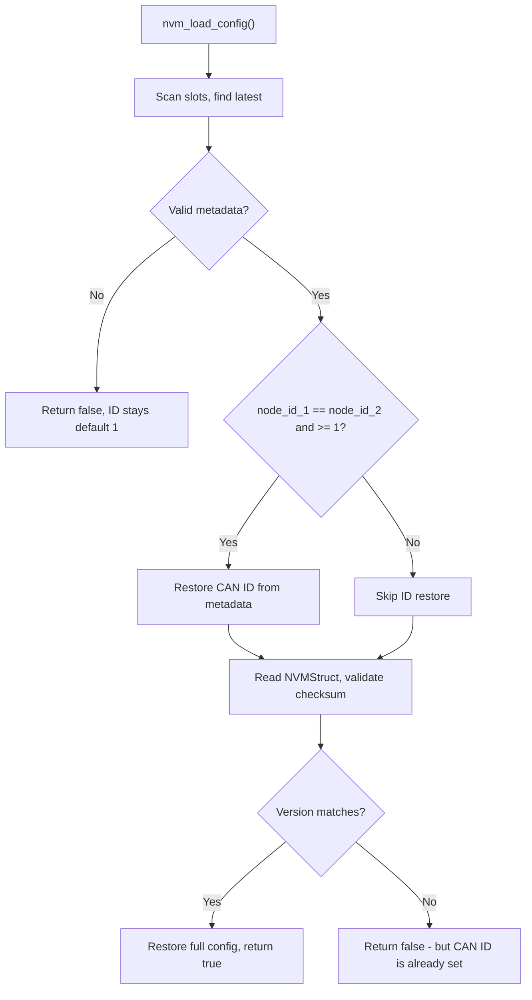

# Tinymovr System Architecture

**Document Type**: Architectural overview
**Target Audience**: AI agents, developers new to the codebase
**Focus**: System structure and design patterns, not implementation details

## Quick Reference

### Entry Points
- **Firmware Entry**: [firmware/src/main.c](firmware/src/main.c)
- **Control Loop**: [firmware/src/controller/controller.c](firmware/src/controller/controller.c)
- **API Specification**: [studio/Python/tinymovr/specs/](studio/Python/tinymovr/specs/)
- **Python Client**: [studio/Python/tinymovr/](studio/Python/tinymovr/)

### Related Documentation
- [SAFETY.md](SAFETY.md) - Safety-critical constraints for motor control
- [PAC5527_NOTES.md](PAC5527_NOTES.md) - MCU hardware architecture
- [AVLOS_GUIDE.md](AVLOS_GUIDE.md) - Communication protocol system
- [CLAUDE.md](CLAUDE.md) - Practical development guide

## System Components

Tinymovr consists of **two separate projects**:

### 1. Firmware (Embedded C)
- **Location**: [firmware/](firmware/)
- **Target**: Qorvo PAC5527 MCU (ARM Cortex-M4F)
- **Purpose**: Real-time motor control (Field-Oriented Control)
- **Architecture**: Bare-metal (no RTOS)
- **Build**: GNU Make + arm-none-eabi-gcc

### 2. Studio (Python)
- **Location**: [studio/Python/](studio/Python/)
- **Target**: Host computer (Linux, macOS, Windows)
- **Purpose**: User interface and motor configuration
- **Architecture**: Schema-driven client (Avlos framework)
- **Build**: Python package (pip install)

### Communication
- **Physical**: CAN bus (CAN 2.0B extended ID)
- **Protocol**: Avlos (schema-driven, auto-generated from YAML)
- **Direction**: Bidirectional (host ↔ firmware)

## Firmware Architecture

### Design Principles

1. **Real-Time**: Fixed 20 kHz control loop with <50 μs deadline
2. **Safety-First**: Automatic error detection and safe state transitions
3. **Modular**: 17 independent modules with clear responsibilities
4. **Cooperative Scheduling**: Single thread, interrupt-driven synchronization
5. **Resource-Constrained**: 32 KB RAM, 128 KB Flash

### Module Organization

**Location**: [firmware/src/](firmware/src/)

| Module | Purpose | Key Responsibilities |
|--------|---------|---------------------|
| **main** | Entry point | Initialization sequence, startup |
| **system** | Platform | Clock config, reset, voltage monitoring |
| **controller** | Control | FOC loops (position → velocity → current) |
| **motor** | Motor mgmt | Calibration (R, L, pole pairs) |
| **sensor** | Encoder I/O | Multiple encoder types (MA7xx, AS5047, AMT22, Hall) |
| **observer** | State est. | Position/velocity estimation from encoder |
| **adc** | Sensing | Current measurement, ADC trigger |
| **gatedriver** | Actuation | PWM generation, Space Vector Modulation |
| **can** | Comm | CAN bus interface, Avlos endpoint dispatch |
| **uart** | Comm | UART interface (same Avlos endpoints as CAN, ASCII by endpoint ID) |
| **ssp** | I/O | SPI for external encoders |
| **nvm** | Storage | Configuration persistence to flash |
| **scheduler** | Timing | Interrupt sync, CPU load monitoring |
| **watchdog** | Safety | Communication timeout detection |
| **timer** | Hardware | PWM timer configuration |
| **utils** | Math | Fast trig, SVM algorithm |
| **rtt** | Debug | SEGGER RTT output (optional) |

**Dependencies**: See [ARCHITECTURE.md Module Map](#module-dependencies) for detailed dependency graph.

### Control Flow

#### Initialization
```
main() entry
  ↓
System initialization (clocks, peripherals)
  ↓
Load configuration from flash (or defaults)
  ↓
Initialize modules (ADC, CAN, timers, watchdog)
  ↓
Enable interrupts
  ↓
Enter control loop (never returns)
```

#### Control Loop Structure
```
Infinite loop:
  ├─ Error checking (overcurrent, undervoltage, etc.)
  ├─ State machine dispatch:
  │   ├─ IDLE: Motors disabled, safe state
  │   ├─ CALIBRATE: Multi-stage calibration sequence
  │   └─ CL_CONTROL: Closed-loop control active
  └─ Wait for ADC interrupt (20 kHz synchronization point)
```

#### Closed-Loop Control (when in CL_CONTROL state)
```
Every 50 μs (20 kHz):
  ├─ Read sensors (encoder, current)
  ├─ Update observers (position, velocity estimation)
  ├─ Position loop (if enabled): pos_error → vel_setpoint
  ├─ Velocity loop (if enabled): vel_error → current_setpoint
  ├─ Current loop (always): current_error → voltage_setpoint
  ├─ Space Vector Modulation: voltage → PWM duties
  └─ Update PWM outputs
```

### State Machine

**States**:
- **IDLE**: Safe state, motors off
- **CALIBRATE**: Executing calibration sequence
- **CL_CONTROL**: Closed-loop control active

**Transitions**:
- User command → State change
- Any error → Automatic transition to IDLE
- Watchdog timeout → Automatic transition to IDLE
- Calibration complete → Automatic transition to IDLE

**Safety**: Errors always force IDLE state. This cannot be disabled.

### Interrupt Architecture

**Priority** (highest to lowest):
1. **ADC IRQ** - Control loop synchronization (20 kHz)
2. **CAN RX** - Incoming messages
3. **UART RX** - Incoming messages (if using UART)
4. **SysTick** - System timing (1 kHz)
5. **Watchdog** - Safety timeout

**Design**: Short ISRs (<10 μs), set flags for main loop processing.

### Calibration System

**Multi-Stage Sequence** (all executed at 20 kHz):
1. **ADC Offset**: Zero current sensors (~1 second)
2. **Resistance (R)**: DC voltage/current measurement (~2 seconds)
3. **Inductance (L)**: AC impedance measurement (~1 second)
4. **Pole Pairs**: Rotation counting (variable duration)
5. **Encoder**: Eccentricity compensation (variable duration)

**Safety Features**:
- Voltage limits per board revision
- Range checking on measured values
- Warm-up and debouncing (recent addition)
- Automatic failure handling

### Memory Organization

**Flash** (128 KB):
- Bootloader: 4 KB @ 0x00000000
- Application: 124 KB @ 0x00001000

**RAM** (32 KB):
- Application: 31.75 KB
- Bootloader shared: 256 bytes

**Optimization**: Critical functions marked for RAM execution (zero wait states).

### Configuration Persistence (NVM)

**Location**: [firmware/src/nvm/](firmware/src/nvm/)

Device configuration is persisted to flash pages 120-127 (8 KB region at `0x0001E000`). The NVM subsystem uses wear-leveling slots so that no single flash page is written disproportionately.

#### Slot Layout

Each slot is laid out as:

```
┌──────────────────────────────── Slot ────────────────────────────────┐
│  NVMMetadata (32 bytes)            │  NVMStruct (config payload)    │
│                                    │                                │
│  byte 0:  node_id_1               │  Per-module configs:           │
│  byte 1:  node_id_2               │    frames, ADC, motor,         │
│  bytes 2-15:  reserved             │    sensors, observers,         │
│  bytes 16-19: sequence_number      │    controller, CAN,            │
│  bytes 20-23: magic (0x544D4E56)   │    trajectory planner,         │
│  bytes 24-25: data_size            │    homing planner              │
│  bytes 26-27: metadata_version     │  version[16] (GIT_VERSION)    │
│  bytes 28-31: metadata_checksum    │  checksum (config integrity)  │
└────────────────────────────────────┴────────────────────────────────┘
```

The metadata header has its own checksum and magic marker, making it independently verifiable even when the config payload is invalid (e.g. after a firmware update changes the version string or struct layout).

#### CAN Node ID Preservation

A critical design goal is that the CAN node ID survives firmware updates. On a multi-device CAN bus, if every device reset to ID 1 after flashing, all devices would collide and become unreachable.

The CAN ID is stored redundantly:
- **In the metadata header**: `node_id_1` and `node_id_2` (bytes 0-1), protected by `metadata_checksum`
- **In the config payload**: inside `CANConfig.id`, protected by the config `checksum`

During boot, `nvm_load_config()` restores the CAN ID from the metadata **before** checking the firmware version:



This means:
- **Normal boot (same firmware)**: Full config is restored, including CAN ID. The early ID restore is a harmless no-op since the full restore writes the same value.
- **After firmware update (version mismatch)**: The metadata is still valid (its format is stable across versions), so the CAN ID is restored. The full config restore fails the version check, so sensors/observers get defaults -- but the device remains addressable on the bus.
- **Corrupted NVM**: Metadata validation fails, function returns early. Device uses default ID 1 (safe fallback).
- **Fresh device**: No valid slots found, default ID 1 is used.

**Bootloader caveat**: The bootloader reads the CAN ID from the fixed address `0x0001E000` (start of slot 0), not the wear-leveled latest slot. If the application has written newer configs to higher slots, the bootloader's CAN ID may differ from the application's. This means `--node_id` for `tinymovr_dfu` must match the bootloader's ID, not necessarily the application's.

#### Saving and Wear Leveling

On save, `nvm_save_config()`:
1. Selects the next slot in round-robin order
2. If the CAN ID has changed since the last save, forces a write to slot 0 (so slot 0 always reflects the current ID)
3. Writes the metadata header followed by the config payload
4. Verifies the write via readback

The slot with the highest sequence number is always the most recent valid config. `nvm_wl_scan_slots()` reconstructs this state on boot.

#### DFU and NVM Preservation

The DFU bootloader's `erase_all` command wipes pages 4-127, which includes the NVM config region (pages 120-127). To prevent config loss during firmware updates, [studio/Python/tinymovr/dfu.py](studio/Python/tinymovr/dfu.py) performs:

- **Before erase**: Reads the entire 8 KB NVM region via `read_flash_32`
- **After firmware write**: Writes the NVM data back via scratchpad + `commit`, skipping erased (all-0xFF) chunks
- **Before reset**: NVM is fully restored, so the device boots with its original config

This ensures the CAN node ID and all other settings survive firmware updates without the device ever appearing at default ID 1 on the bus.

### Board Revision Support

Multiple hardware revisions supported via compile-time configuration:
- **R3.x**: Original design
- **R5.x**: Updated layout, improved EMI
- **M5.x**: Gimbal motor variant (lower current)

**Differences**: CAN pin assignments, current limits, calibration parameters.

## Studio Architecture (Python)

### Design Principles

1. **Schema-Driven**: API auto-generated from YAML specifications
2. **Device-Agnostic**: Supports multiple firmware versions simultaneously
3. **Unit-Aware**: Physical units (Pint library integration)
4. **Hardware-in-the-Loop**: Comprehensive test infrastructure
5. **Multi-Device**: Multiple Tinymovr devices on same bus

### Key Components

**Location**: [studio/Python/tinymovr/](studio/Python/tinymovr/)

| Component | Purpose |
|-----------|---------|
| **specs/** | YAML API specifications (one per firmware version) |
| **config/** | Spec loading, device discovery, hash matching |
| **bus_router** | Message distribution to multiple devices |
| **bus_manager** | CAN bus connection with auto-reconnect |
| **channel** | Per-device communication channel |
| **device_discovery** | Automatic device detection via heartbeat |
| **codec** | Binary serialization/deserialization |
| **cli** | IPython-based command-line interface |
| **gui/** | Qt-based graphical interface |
| **tests/** | Hardware-in-the-loop test suite |

### Communication Stack

```
Application
  ↓
Device Object (dynamically generated from YAML spec)
  ↓
CANChannel (per device, identified by node_id)
  ↓
BusRouter (singleton, message distribution)
  ↓
BusManager (wraps python-can, auto-reconnect)
  ↓
python-can library
  ↓
CAN hardware adapter (CANine, slcan, socketcan, etc.)
```

### Schema-Driven API (Avlos)

**Workflow**:
```
YAML Spec
  ↓
avlos.generate (code generation tool)
  ├─→ Firmware C code (can_endpoints.c/h)
  ├─→ Firmware enums (tm_enums.h)
  └─→ Documentation (RST files)

YAML Spec (at runtime)
  ↓
avlos.deserialize
  ↓
Python Object Tree (dynamic attribute access)
```

**Benefits**:
- Single source of truth
- Firmware and client always synchronized
- Protocol versioning via hash
- Self-documenting API

### Device Discovery

**Process**:
1. Listen for CAN heartbeat messages
2. Extract protocol hash from heartbeat
3. Match hash to YAML spec
4. Deserialize spec into Python object
5. Create device instance

**Result**: Automatic instantiation of correct client version for each device.

### Testing Infrastructure

**Test Types**:
- **Simulation**: No hardware required, logic validation
- **HITL**: Hardware-in-the-loop, requires physical Tinymovr
- **Sensor-Specific**: Tests for particular encoder types
- **End-of-Line**: Comprehensive production tests

**Test Markers** (pytest):
- `@pytest.mark.hitl_default`
- `@pytest.mark.sensor_amt22`
- `@pytest.mark.sensor_as5047`
- `@pytest.mark.sensor_hall`
- `@pytest.mark.eol`
- `@pytest.mark.dfu`

## Communication Protocol (Avlos)

### Design

- **Schema-Driven**: Defined in YAML, not hand-coded
- **Hierarchical**: Tree structure of attributes
- **Typed**: Strong type system (float, uint32, bool, enums, etc.)
- **Versioned**: Protocol hash ensures compatibility
- **Bidirectional**: Read/write/call operations

### CAN Bus Encoding

**Arbitration ID** (29-bit extended):
- Node ID field (device address)
- Protocol hash field (version identifier)
- Endpoint ID field (parameter/function identifier)

**Payload**:
- Binary serialization (little-endian)
- Up to 8 bytes per frame
- Type-specific encoding (float, int, string, etc.)

### Version Management

**Multi-Version Support**:
- Multiple YAML specs for different firmware versions
- Runtime hash matching
- Graceful degradation if hash mismatch
- Hash aliases for backward compatibility

## Hardware Architecture

### Supported Boards

| Revision | Family | Application | Current Range |
|----------|--------|-------------|---------------|
| R3.x | R3 | High-current | 5-30 A |
| R5.x | R5 | High-current (improved) | 5-30 A |
| M5.x | M5 | Gimbal motors | 1-10 A |

**Compile-Time Selection**: `make release REV=R52`

### Encoder Support

**Types**:
1. MA7xx (MPS magnetic) - Onboard
2. AS5047 (AMS magnetic) - External SPI
3. AMT22 (CUI absolute) - External SPI
4. Hall effect - 3× digital inputs

**Normalization**: All encoders normalized to 13-bit resolution (8192 ticks/rev).

**Dual Sensor**: Supports simultaneous commutation and position sensors.

## Key Design Decisions

### Firmware

1. **No RTOS**: Bare-metal for predictability and low overhead
2. **Fixed 20 kHz PWM**: Simplifies timing analysis, above audible range
3. **RAM Execution**: Critical functions run from RAM for deterministic timing
4. **Cooperative Scheduling**: Single control thread, no preemption
5. **Automatic Safety**: Errors force IDLE state, cannot be disabled

### Studio

1. **Schema-Driven**: Avlos framework eliminates manual wrapper coding
2. **Dynamic Objects**: Python objects created at runtime from YAML
3. **Unit System**: Pint integration for physical units
4. **Multi-Device**: BusRouter enables multiple devices on one bus
5. **Version Agnostic**: Supports multiple firmware versions simultaneously

### Protocol

1. **CAN Bus**: Industry-standard, reliable, multi-drop
2. **Extended ID**: 29-bit allows encoding of version and endpoint
3. **Binary Encoding**: Efficient, minimal bandwidth
4. **Hash Versioning**: Detects incompatibilities automatically

## Module Dependencies

### Firmware Core Dependencies

```
main
 ├─→ system (clocks, reset)
 ├─→ nvm (config loading)
 ├─→ adc (current sensing)
 ├─→ can (communication)
 ├─→ uart (alternative comm)
 ├─→ timer (PWM setup)
 ├─→ watchdog (safety)
 └─→ controller (control loop)
      ├─→ motor (calibration, parameters)
      ├─→ observer (state estimation)
      │    └─→ sensor (encoder reading)
      │         └─→ ssp (SPI for external encoders)
      ├─→ gatedriver (PWM output)
      │    └─→ timer (hardware config)
      └─→ scheduler (timing sync)
```

### Studio Core Dependencies

```
Application
 └─→ Device (from config.create_device)
      ├─→ CANChannel (from channel.py)
      │    ├─→ BusRouter (singleton from bus_router.py)
      │    │    └─→ BusManager (from bus_manager.py)
      │    │         └─→ python-can
      │    └─→ MultibyteCodec (from codec.py)
      └─→ Avlos-generated attributes (from specs/*.yaml)
           └─→ Pint units (if unit specified in YAML)
```

## Critical File Reference

### Firmware
- [firmware/src/main.c](firmware/src/main.c) - Entry point
- [firmware/src/controller/controller.c](firmware/src/controller/controller.c) - Control loop
- [firmware/src/motor/motor.c](firmware/src/motor/motor.c) - Calibration
- [firmware/src/config.h](firmware/src/config.h) - System constants
- [firmware/src/common.h](firmware/src/common.h) - Board revisions, includes
- [firmware/Makefile](firmware/Makefile) - Build system

### Studio
- [studio/Python/tinymovr/specs/](studio/Python/tinymovr/specs/) - API definitions (YAML)
- [studio/Python/tinymovr/config/config.py](studio/Python/tinymovr/config/config.py) - Spec loading
- [studio/Python/tinymovr/bus_router.py](studio/Python/tinymovr/bus_router.py) - Message routing
- [studio/Python/tinymovr/channel.py](studio/Python/tinymovr/channel.py) - Device communication
- [studio/Python/tests/tm_test_case.py](studio/Python/tests/tm_test_case.py) - Test base class

### Protocol
- [avlos_config.yaml](avlos_config.yaml) - Code generation config
- [firmware/src/can/can_endpoints.h](firmware/src/can/can_endpoints.h) - Generated endpoints (C)
- [firmware/src/tm_enums.h](firmware/src/tm_enums.h) - Generated enums (C)

## Build System

### Firmware Build

**Toolchain**: GNU ARM Embedded (arm-none-eabi-gcc)
**Build Tool**: GNU Make
**Targets**: `debug`, `release`, `clean`
**Board Selection**: `REV=R52` (or R53, M51, etc.)

**Linker Script**: [firmware/pac55xx.ld](firmware/pac55xx.ld) - Memory layout

### Studio Build

**Python Version**: 3.9+
**Package Manager**: pip
**Install**: `pip install -e .` (editable mode)
**Optional GUI**: `pip install -e .[gui]`

### Code Generation

**Tool**: Avlos (Python package)
**Command**: `avlos from file <spec_file>.yaml`
**Input**: YAML specs in [studio/Python/tinymovr/specs/](studio/Python/tinymovr/specs/)
**Output**: C code, enums, documentation

## Development Environment

### Required Tools

**Firmware**:
- arm-none-eabi-gcc
- GNU Make
- PAC55xx SDK (download from Qorvo)
- Optional: J-Link debugger

**Studio**:
- Python 3.9+
- CAN interface hardware
- pytest (for testing)

**Documentation**:
- Sphinx
- Furo theme

### Debug Interfaces

**Firmware**:
- SWD/JTAG (pins: SWDIO, SWCLK)
- SEGGER RTT (zero-overhead debug output)

**Studio**:
- python-can debug logging
- pytest verbose output

## Cross-References

For detailed information, see:
- **Safety Constraints**: [SAFETY.md](SAFETY.md)
- **MCU Hardware**: [PAC5527_NOTES.md](PAC5527_NOTES.md)
- **Protocol System**: [AVLOS_GUIDE.md](AVLOS_GUIDE.md)
- **Development Guide**: [CLAUDE.md](CLAUDE.md)
- **Contributing**: [CONTRIBUTING.md](CONTRIBUTING.md)
- **User Documentation**: [docs/](docs/)

---

**Document Focus**: Architectural patterns and structure, not implementation details.
**For Implementation**: See source code and related documentation above.
